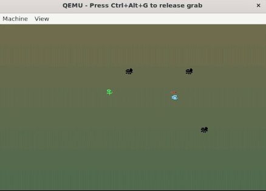

# Get The Flower
A fun bootsector game using x86

## Running The Game

### Prequisite for building
- QEMU (x86_64)
- NASM

### Build & Run
```
$ cd src/
$ ./build-and-run.sh getTheFlower
```


## Controls and Objective
- Use <kbd>Spacebar</kbd> to rotate the butterfly
- Release <kbd>Spacebar</kbd> to let butterfly fly in the required direction
- Avoid the spiders
- Get The Flower!!

